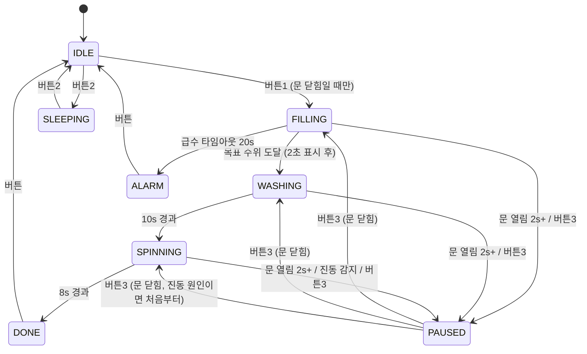

# 세탁기 안전 제어 시스템 (Arduino Uno)

실제 세탁기의 안전 로직을 아두이노로 재현한 임베디드 프로젝트입니다.
대기 → 급수 → 세탁 → 탈수 → 완료로 이어지는 상태 머신 위에
도어 인터록, 문 열림 감지, 탈수 불균형 감지, 급수 타임아웃, 절전모드를 구현했습니다.

기능이 "돌아가는 것"에서 멈추지 않고,

- 모든 판정 임계값을 실측 데이터로 캘리브레이션하고
- 소비 전류를 계측기로 직접 측정해 수치로 남기고
- 개발 중 겪은 문제의 원인과 해결 과정을 기록하는 것

을 목표로 진행했습니다.

## 데모 영상

[영상 링크 - 추가 예정]

한 영상 안에 세 구간으로 나눠서 담았습니다.

1. **정상 동작 전체 흐름** — 도어 인터록(문 열린 상태에서 시작 불가 → "Close the door") 확인 후 정상 사이클 완주
2. **도어 안전 로직** — 짧은 문 접촉은 무시(디바운스) → 2초 이상 열림 시 안전 정지 → 문을 닫아야만 재개 가능 → 버튼 일시정지/재개
3. **탈수 중 진동 감지** — 진동 감지 즉시 정지 + 경보 → 재개 시 탈수를 처음부터 재시도

## 하드웨어 구성

| 부품 | 용도 |
|---|---|
| Arduino Uno | 메인 컨트롤러 |
| 1602 LCD (병렬 4비트) | 상태 / 급수 진행률 / 남은 시간 표시 |
| 리드 스위치 모듈 | 도어 열림/닫힘 감지 (자석) |
| 기울기 센서 | 탈수 불균형(진동) 감지 |
| 물높이 센서 (전도성 접점식) | 급수 수위 감지 |
| 릴레이 모듈 | 급수 밸브 역할 |
| 수동 부저 | 시작 / 경보 / 완료 멜로디 |
| LED 2개 (빨강/초록) | 도어 잠금 / 열림 상태 표시 |
| 푸시버튼 3개 + 저항 래더 | 시작 / 절전 / 일시정지·재개 (아날로그 1핀으로 통합) |
| 28BYJ-48 + ULN2003 | 드럼(탈수) 회전 |
| 외부 5V 전원 | 스텝모터 전원 (아두이노 전원 라인과 분리) |

### 핀맵

| 핀 | 연결 |
|---|---|
| D2 | 리드스위치 DO |
| D3 | 기울기센서 (INPUT_PULLUP) |
| D4~D9 | 1602 LCD (RS, E, D4~D7) |
| D10 | 수동부저 |
| D11 | 릴레이 |
| D12 / D13 | 빨강 LED(닫힘) / 초록 LED(열림) |
| A0 | 물높이센서 |
| A1 | 버튼 3개 (저항 래더) |
| A2~A5 | ULN2003 IN1~IN4 |

## 상태 머신



## 주요 안전 기능

**도어 인터록** — 문이 열려 있으면 시작 버튼이 동작하지 않고 "Close the door" 안내만 표시합니다. 동작 시작의 전제 조건에 도어 상태를 포함시킨 가장 기본적인 안전 장치입니다.

**문 열림 디바운스 (2초)** — 리드 스위치가 예민해서 자석이 살짝 흔들리기만 해도 순간적인 열림이 잡혔습니다. 짧은 접촉으로 세탁이 멈추는 오동작을 막기 위해, 2초 이상 지속된 열림만 안전 정지로 인정합니다.

**재개 조건 제한** — 일시정지 상태에서 문이 열려 있으면 재개 버튼이 동작하지 않습니다. 재개 역시 안전 조건(문 닫힘)을 만족해야만 가능합니다.

**탈수 불균형 감지** — 탈수 중 기울기 센서에서 진동이 1회라도 감지되면 즉시 정지하고 경보를 울립니다. 재개하면 탈수를 처음부터 다시 시작하는데, 이는 실제 세탁기가 세탁물 재배치 후 탈수를 재시도하는 로직을 따른 것입니다.

**급수 타임아웃** — 20초 안에 목표 수위에 도달하지 못하면 밸브/센서 이상으로 판단해 ALARM으로 전환합니다. 심각한 이상 상황으로 간주하므로 재개는 불가능하고 리셋만 허용합니다.

**정전 복구 안전 처리** — 상태를 EEPROM에 저장하지만, 부팅 시 동작 중이던 상태(급수/세탁/탈수 등)로 저장돼 있으면 자동 재개하지 않고 대기로 복귀합니다. 정전 후 아무도 없는 상태에서 밸브나 모터가 멋대로 재가동되는 것을 막기 위한 설계입니다.

## 절전모드와 소비 전류 실측

처음에는 AVR Power-down(`SLEEP_MODE_PWR_DOWN`)으로 구현했으나, 이 방식은 외부 인터럽트 핀(D2, D3)으로만 깨울 수 있어 아날로그 핀(A1)에 물린 버튼으로는 해제가 불가능했습니다. 그래서 릴레이/LED를 끄고 LCD 표시를 꺼둔 채 버튼 폴링만 유지하는 소프트웨어 절전 방식으로 변경했습니다. 버튼2로 진입/해제를 토글합니다.

멀티미터(Metex M-3860M)를 LED 공급 라인에 직렬 삽입(DC mA)해 측정했습니다.

| 상태 | LED 라인 전류 |
|---|---|
| 대기 (LED 점등) | 12.41 mA |
| 절전 (LED 소등) | ≈ 0 mA (표시값 -0.02 mA, 극성/오차 수준) |

측정값 12.41mA는 (5V − LED 순방향전압 약 2V) ÷ 직렬저항 220Ω ≈ 13.6mA인 이론치와 부합합니다.

측정 범위의 한계도 명시합니다.

- MCU와 LCD는 USB 전원 라인에 있어 이번 측정 대상에서 제외했습니다 (별도 USB 전류계 필요).
- LCD 백라이트는 하드웨어 결선상 상시 전원이라 소프트웨어로 제어할 수 없습니다.
- 따라서 이 수치는 시스템 전체가 아닌 "절전 시 차단되는 부품 라인"의 전류 변화를 보여주는 것입니다.

측정 사진: `docs/` 폴더 참고 (대기 상태 / 절전 상태 / 측정 배선)

## 센서 캘리브레이션

### 물높이 센서

전도성 접점식 센서라 물이 조금만 닿아도 ADC값이 400대까지 급등하는 비선형 특성이 있습니다. 단순 비례식으로는 표시값이 왜곡돼서, 실측 4개 지점을 구간별 선형 보간하는 방식으로 변환합니다.

| 실측 ADC | 표시 % |
|---|---|
| 0 (건조) | 0 |
| 410 (소량) | 33 |
| 520 (중간) | 67 |
| 660 (목표 수위) | 100 — 이 지점에서 급수 정지 |

### 버튼 (저항 래더)

버튼 3개를 저항 분압으로 아날로그 핀 하나(A1)에서 판별합니다.

| 버튼 | 기능 | 실측 ADC | 허용 오차 |
|---|---|---|---|
| 1 | 시작 | 1019 | ±40 |
| 2 | 절전 토글 | 509 | ±40 |
| 3 | 일시정지 / 재개 | 338 | ±40 |

### 논리 레벨 (실측 확인)

- 리드스위치: 문 닫힘(자석 접근) = LOW
- 기울기센서: 평상시 LOW, 진동 시 HIGH

## 개발 중 겪은 문제와 해결

| 증상 | 원인 | 해결 |
|---|---|---|
| 버튼을 안 눌러도 ADC 200~300대 잡음 | 아날로그 핀 플로팅 | 풀다운 10kΩ 추가 |
| 재부팅해도 완료 화면에 갇힘 | EEPROM에 DONE 상태가 저장된 채 그대로 복원 | 동작 관련 상태는 부팅 시 무조건 IDLE로 리셋 |
| 수위 100% 도달 후에도 릴레이가 안 꺼짐 | FILLING 진입부에서 매 루프 무조건 HIGH 재설정 → 완료 시 꺼도 다음 루프에 다시 켜짐 | 완료 플래그를 조건으로 걸어 HIGH 재설정 차단 |
| 자석이 살짝 스치기만 해도 안전 정지 | 리드 스위치 과민 반응 | 2초 연속 열림만 인정하는 디바운스 도입 |
| 불균형 정지 직후 완료 상태로 덮이는 레이스 가능성 | 같은 루프에서 PAUSED 전환 후 완료 판정이 이어서 실행됨 | 상태 전환 직후 break로 루프 탈출 |
| 멜로디 구조체를 함수 인자로 넘기면 컴파일 에러 | Arduino IDE가 함수 프로토타입을 구조체 정의보다 앞에 자동 생성 | 배열 + 정수 인덱스 방식으로 우회 |
| 수위 %가 초반엔 안 오르다 후반에 급등 | 접점식 센서의 비선형 응답 | 실측 4점 룩업테이블 + 구간별 선형 보간 |
| Power-down 절전에서 버튼으로 깨어나지 못함 | A1(아날로그 핀)은 외부 인터럽트 미지원 | 소프트웨어 절전 방식으로 설계 변경 |
| 도어락용 서보모터 동작 불량 | 모듈 하드웨어 불량 | LED 2개(잠금/열림 표시)로 대체 |

## 한계와 개선 방향

- 물높이 센서의 해상도와 선형성 한계 — 정전용량식이나 압력식 센서로 교체하면 개선 가능
- 절전이 MCU 딥슬립이 아님 (폴링 유지로 MCU 소비전력은 그대로) — 버튼을 외부 인터럽트 핀으로 옮기거나 핀 체인지 인터럽트를 쓰면 Power-down 적용 가능
- LCD 백라이트 상시 점등 — 트랜지스터로 백라이트 라인을 스위칭하면 절전 대상에 포함 가능
- `Stepper.step(50)` 호출 동안 짧은 블로킹 발생 — 논블로킹 스텝 제어로 개선 여지
- 단일 .ino 파일 구조 — 규모가 커지면 기능별 모듈 분리 필요

## 빌드 및 실행

- Arduino IDE + Arduino Uno
- 외부 라이브러리 없음 (LiquidCrystal / Stepper / EEPROM 기본 내장)
- `washer_safety_control/washer_safety_control.ino` 열어서 업로드

센서 특성은 개체마다 다르므로, 다른 환경에서 재현할 경우 `waterAdcPoints`와 `BTNx_ADC` 값을 시리얼 모니터로 실측한 뒤 수정해야 합니다.

## 저장소 구조

```
arduino-washer-safety-system/
├── washer_safety_control/
│   └── washer_safety_control.ino
├── docs/                # 측정 사진, 배선 사진
├── README.md
├── LICENSE
└── .gitattributes
```

## License

MIT
